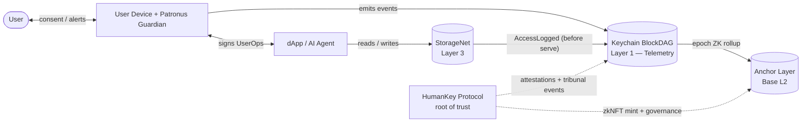

# Keychain Protocol — Overview

> **Sister protocol:** [HumanKey](https://github.com/lehelkovach/human-key-core) — the Proof-of-Live-Human-Presence root-of-trust that sits on top of Keychain.

## 1. The thesis

Keychain is a **Consent-Mediated Identity Bus** and a **Dynamic Identity Firewall**.

It replaces the silent half of OAuth — the part where, after one click of "Allow", a token gets used over and over by apps and AI agents that the user can no longer see — with an architecture of **Conspicuous Usage**: every session issuance, every delegated action, every AI agent operation, every storage access generates an immutable cryptographic log entry that triggers an immediate alert to the user's sovereign devices.

By separating high-frequency *event telemetry* from financial settlement, Keychain provides the throughput substrate that high-cadence identity auditing has never had on traditional blockchains.

## 2. Four layers, one principle

| # | Layer | Role | Throughput target | Doc |
|---|---|---|---|---|
| **L1** | **Keychain BlockDAG** | Execution + telemetry. GHOSTDAG-inspired parallel block processing optimized for event data, not currency UTXOs. Sub-cent per event, sub-second visibility. | thousands of events/sec | [`01-layer1-blockdag.md`](01-layer1-blockdag.md) |
| **L2** | **Anchor Layer** | Periodic Merkle-root commits to an Ethereum L2 (Base — see [ADR-0004](adr/ADR-0004-l2-selection-base-vs-arbitrum.md)). Inherits Ethereum's economic security for final settlement. | 1 anchor / epoch | [`02-layer2-anchor.md`](02-layer2-anchor.md) |
| **L3** | **StorageNet** | Encrypted decentralized custody for identity-bound data (Patronus memory, ontologies, metadata). Every access emits an L1 event **before** the data plane responds. | per-object | [`03-layer3-storagenet.md`](03-layer3-storagenet.md) |
| **L4** | **Patronus Guardian** | Local AI orchestrator running on the user's device. Consent enforcement, risk scoring, ERC-4337 ephemeral key derivation, anomaly subscription. The only component the user has to actively trust on their own hardware. | local | [`04-patronus-guardian.md`](04-patronus-guardian.md) |

The principle that unifies them is **Conspicuous Usage**: no identity action is silent ([`05-conspicuous-usage.md`](05-conspicuous-usage.md)).

## 3. Repo map

```
key-chain-network/
├── docs/
│   ├── 00-overview.md                       (you are here)
│   ├── 01-layer1-blockdag.md
│   ├── 02-layer2-anchor.md
│   ├── 03-layer3-storagenet.md
│   ├── 04-patronus-guardian.md
│   ├── 05-conspicuous-usage.md
│   ├── 06-erc4337-ephemeral-keys.md
│   ├── 07-threat-model.md
│   ├── 08-glossary.md
│   ├── 09-consent-transitivity.md
│   └── adr/
│       ├── ADR-0001-ephemeral-dag-pruning-zk-rollups.md
│       ├── ADR-0002-web-of-trust-proxy-upgrade.md
│       ├── ADR-0003-pairwise-dids-persona-abstraction.md
│       ├── ADR-0004-l2-selection-base-vs-arbitrum.md
│       ├── ADR-0005-event-fee-economic-model-sketch.md
│       ├── ADR-0006-out-of-dom-consent.md
│       ├── ADR-0007-erc4337-session-key-hardening.md
│       └── ADR-0008-caep-ssf-wire-format.md
├── interfaces/
│   ├── contracts/
│   │   ├── IKeychainAnchor.sol
│   │   ├── IKeychainUpgradeGovernor.sol
│   │   ├── IPairwiseDIDRegistry.sol
│   │   ├── IEphemeralSessionKeyManager.sol
│   │   ├── IStorageNetGateway.sol
│   │   ├── SharedStructs.sol                ◀ SHARED with HumanKey
│   │   └── events/
│   │       └── IConspicuousUsageEvents.sol  ◀ SHARED with HumanKey
│   └── ts/
│       ├── patronus-guardian.ts
│       ├── dag-client.ts
│       ├── anchor-client.ts
│       ├── storagenet-client.ts
│       ├── caep-emitter.ts
│       └── shared-types.ts                  ◀ SHARED with HumanKey
└── diagrams/
    ├── 01-system-context.mmd
    ├── 02-container.mmd
    ├── 03-conspicuous-usage-sequence.mmd
    ├── 04-anchor-rollup-sequence.mmd
    ├── 05-patronus-data-flow.mmd
    └── 06-out-of-dom-consent.mmd
```

## 4. System context



## 5. Threat model coverage

Keychain's design is grounded in current (2025–2026) authentication threat literature. The full STRIDE × layer matrix lives in [`07-threat-model.md`](07-threat-model.md). The headline classes that motivated the architecture:

- **V1 — Adversary-in-the-Middle session theft** (Evilginx, Tycoon 2FA, Mamba 2FA): Conspicuous Usage makes a stolen session cookie observable to the user within seconds; the 24h dispute window invalidates it; the corresponding ERC-4337 session key (which never left Patronus) is what actually authorizes anything.
- **V10 — AI agent OAuth token theft** (Mitiga Labs Apr 2026, Claude Code `~/.claude.json`): ephemeral session keys are HKDF-derived per session, never persisted to disk. The "steal the file" attack has nothing to steal.
- **V11 — OAuth consent phishing** ("EvilTokens", CSA May 2026): every consent grant is a conspicuous event. The malicious app's first action surfaces to the user.
- **V13 — Sub-agent authority inheritance** (OpenID Foundation Oct 2025): F3 consent transitivity (formal scope-monotonicity, [`09-consent-transitivity.md`](09-consent-transitivity.md)) makes inheritance explicit and bounded.
- **V23 — Cross-context correlation**: Pairwise DIDs ([ADR-0003](adr/ADR-0003-pairwise-dids-persona-abstraction.md)) — root DID never appears on-chain.
- **V24–V27 — ERC-4337 session-key vulnerabilities** (Trail of Bits Mar 2026, OpenZeppelin/Spearbit audits): the hardening ADR ([ADR-0007](adr/ADR-0007-erc4337-session-key-hardening.md)) mandates inner-calldata inspection, multicall denylist, signed gas fields, signed chain-id, and stateless validation.

## 6. NIST SP 800-63B-4 (Aug 2025) AAL mapping

The Keychain `SessionPolicy.requiredAal` field (see `SharedStructs.sol`) lets validators enforce the right NIST Authenticator Assurance Level per session.

| AAL | NIST requirement | Keychain mapping | HumanKey tier |
|---|---|---|---|
| AAL1 | Single factor | Passkey bound to Pairwise DID | Low |
| AAL2 | Two factors; phishing-resistant option required | Hardware-backed authenticator (F2) + local biometric verified by Patronus + device attestation (F5) | Moderate |
| AAL3 | Hardware-backed, non-exportable, phishing-resistant required | All AAL2 + TEE-attested live video liveness + Cognitive MFA, voice never sole modality (F6) | High |

## 7. Traceability matrix

Every design requirement traces to a doc, an interface, optionally a diagram, and optionally an ADR.

| Source | Doc | Interface | Diagram | ADR |
|---|---|---|---|---|
| WP1 §3 Layer 1 (BlockDAG) | `01-layer1-blockdag.md` | `events/IConspicuousUsageEvents.sol` | 02, 03 | — |
| WP1 §3 Layer 2 (Anchor) | `02-layer2-anchor.md` | `IKeychainAnchor.sol` | 04 | ADR-0004 |
| WP1 §3 Layer 3 (StorageNet) | `03-layer3-storagenet.md` | `IStorageNetGateway.sol` | 02 | — |
| Handoff §Patronus Guardian | `04-patronus-guardian.md` | `ts/patronus-guardian.ts` | 05 | — |
| Handoff §Conspicuous Usage | `05-conspicuous-usage.md` | `events/IConspicuousUsageEvents.sol` | 03 | — |
| Handoff §ERC-4337 ephemeral keys | `06-erc4337-ephemeral-keys.md` | `IEphemeralSessionKeyManager.sol` | 05 | — |
| Handoff §Flaw 1 (DAG state bloat) | `01-layer1-blockdag.md` §pruning | — | 04 | ADR-0001 |
| Handoff §Flaw 2 (admin key trap) | `02-layer2-anchor.md` §upgrade | `IKeychainUpgradeGovernor.sol` | — | ADR-0002 |
| Handoff §Flaw 3 (cross-context correlation) | `06-erc4337-ephemeral-keys.md` §pairwise | `IPairwiseDIDRegistry.sol` | 05 | ADR-0003 |
| F1 — out-of-DOM consent | `04-patronus-guardian.md` | `ts/patronus-guardian.ts` `requestConsentOutOfDom()` | 06 | ADR-0006 |
| F3 — consent transitivity | `09-consent-transitivity.md` | `IEphemeralSessionKeyManager.sol` `parentSessionId` | 05 | — |
| F4 — LLM key isolation | `04-patronus-guardian.md` | `ts/patronus-guardian.ts` | — | — |
| F7 — ERC-4337 hardening | `06-erc4337-ephemeral-keys.md` | NatSpec on `IEphemeralSessionKeyManager.sol` | — | ADR-0007 |
| F8 — periodic session audit | `04-patronus-guardian.md` | `ts/patronus-guardian.ts` `listActiveSessions()` | — | — |
| P1 — CAEP/SSF wire format | `05-conspicuous-usage.md` appendix | `ts/caep-emitter.ts` | — | ADR-0008 |

(F2, F5, F6, F9, P2, P5 live in the sibling HumanKey repo.)

## 8. Status

This repo is in the **design pass**: documentation, interface declarations, ADRs, and Mermaid diagrams only. No production smart-contract bodies. No BlockDAG node software. No ZK circuits. No Patronus UI.

The downstream implementation work — Foundry/Hardhat projects, Rust DAG client, circom/Noir circuits, Patronus app shells, TEE oracle deployment — is intentionally out of scope until the design here is reviewed and accepted.

## 9. License

MIT — see [LICENSE](../LICENSE).
