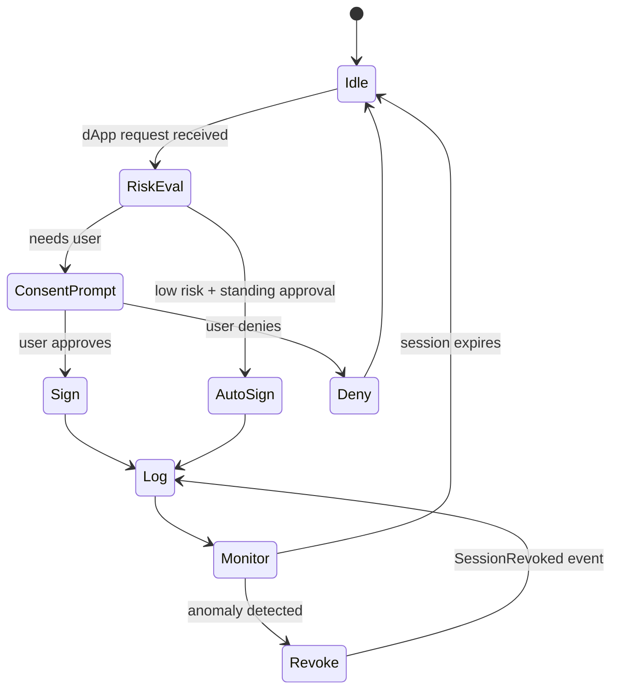
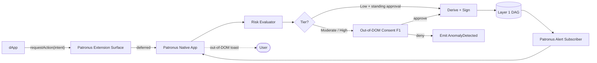

# Patronus Guardian — Local AI Orchestrator

> The one component the user actively trusts on their own hardware.

## 1. What Patronus is

Patronus is the user's **local AI orchestrator**. It runs on the user's device (mobile, desktop, optionally a TEE-assisted edge co-processor) and is the user's representative inside the Keychain stack.

Patronus is responsible for:

1. **Intent interpretation** — translating a user request ("buy 0.1 ETH worth of token X") into one or more concrete protocol operations.
2. **Risk scoring** — evaluating each operation in the [Adaptive Escalation matrix](https://github.com/lehelkovach/human-key-core/blob/main/docs/03-adaptive-escalation.md) and choosing a tier (Low/Moderate/High).
3. **Consent enforcement** — making sure no protocol operation is performed without explicit user consent, via an **out-of-DOM consent channel** (F1; see §4).
4. **Ephemeral key derivation** — deriving short-lived ERC-4337 session keys per pairwise DID per scope, signing UserOps, never persisting key material to disk.
5. **DAG subscription** — listening to Conspicuous Usage events for all of the user's pairwise commitments and surfacing alerts in real time.
6. **Anomaly response** — when DAG telemetry shows a suspicious pattern, raising the risk tier and (if configured) auto-revoking sessions.
7. **Periodic session audit** (F8) — surfacing a "stale session" view quarterly and offering one-click revocation.
8. **Proof-of-Life tick** — for HumanKey users, signing a periodic `pingAlive()` to the Inheritance time-lock so the dead-man's switch does not fire spuriously.

## 2. Trust boundary

- **Trusted by:** the user (the only principal Patronus serves).
- **Adversarial to:** every dApp, every relayer, every storage node, every notary.
- **Never holds:** plaintext biometrics (those stay in the device's secure enclave or are handled by the TEE Liveness Oracle).
- **Always holds:** the user's root DID secret (under hardware-enclave protection where available).

Patronus is **not** a server. There is no Patronus cloud. Implementations may use a cloud-side broker for push notifications, but the broker sees only opaque encrypted blobs.

## 3. State machine

## 4. The out-of-DOM consent channel (F1)

This is Patronus's hardest security requirement. See [ADR-0006](adr/ADR-0006-out-of-dom-consent.md).

**Problem:** any consent UI that renders in the browser's DOM is exploitable. DEF CON 33 (Aug 2025) demonstrated real-time WebAuthn prompt spoofing against synced passkeys. Scott Helme's "XSS Is Deadly for Passkeys" research showed page-level adversaries can substitute a passkey at registration via `navigator.credentials.create()` hijacking. Any in-page consent dialog is downstream of XSS.

**Solution:** Patronus owns the consent ceremony in a **separate UI surface** that cannot be reached from the DOM:

| Patronus form-factor | Out-of-DOM channel |
|---|---|
| Native mobile app | OS-level system overlay; signing requires a confirmation in the Patronus app, not in the browser |
| Native desktop app | OS-level toast / panel reachable only via OS notification subsystem |
| Hardware token (FIDO2-style) | Physical button press, separate display |
| TEE-backed companion device | Bluetooth-paired companion that prompts on its own screen |

The dApp can *request* consent (via a Patronus-issued WebExtension API or post-message). The dApp can *never* render or proxy the dialog.

Browser-extension Patronus (Pivot P3) is **deferred to v2**; in v1 the dApp must talk to a native Patronus instance.

## 5. LLM key isolation policy (F4)

Patronus integrates with the user's LLM-driven agent stack (Claude, GPT, local models). To avoid the Mitiga Apr 2026 / `~/.claude.json` style of attack:

1. The LLM **never sees private key bytes**. Ever. Not in memory, not in logs, not in tool-call payloads.
2. The LLM can only request a signature over a hash it constructs and submits to Patronus.
3. The signing request is routed through the F1 out-of-DOM consent channel for any action above the Low risk tier.
4. The LLM's tool-call surface to Patronus is fixed and minimal: `submitAction(actionHash, scope)`, `listActiveSessions()`, `revokeSession(sessionId)`. There is no `getKey()` or `exportSecret()` and never will be.

## 6. The interface

The full TypeScript declaration surface is in [`interfaces/ts/patronus-guardian.ts`](../interfaces/ts/patronus-guardian.ts). Headline methods:

| Method | Purpose |
|---|---|
| `evaluateRisk(ctx: RiskContext): Promise<RiskTier>` | Score the requested action; pick a tier. |
| `requestConsentOutOfDom(intent: Intent): Promise<ConsentResult>` | F1 — render the consent UI in the out-of-DOM channel. |
| `deriveSessionKey(pairwise: PairwiseCommitment, policy: SessionPolicy): Promise<SessionHandle>` | Derive an ephemeral 4337 key under a pairwise DID with a stated policy. Key never returns to caller. |
| `signUserOp(session: SessionHandle, userOpHash: Hex32): Promise<HexBytes>` | Sign a 4337 UserOp; emits `SessionUsed`. |
| `submitDagEvent(event: ConspicuousEvent): Promise<void>` | Patronus-as-emitter (e.g., `AnomalyDetected` from local heuristics). |
| `subscribeAlerts(callback: (event: ConspicuousEvent) => void): Subscription` | Real-time alert stream. |
| `listActiveSessions(pairwise?: PairwiseCommitment): Promise<SessionSummary[]>` | F8 — for the periodic session-audit prompt. |
| `revokeSession(sessionId: Hex32, reason: ReasonCode): Promise<void>` | One-click revoke from the audit UX. |
| `pingAlive(): Promise<void>` | Proof-of-Life tick for HumanKey inheritance. |
| `runCognitiveChallenge(challenge: CognitivePrompt): Promise<CognitiveResponse>` | For HumanKey High-tier flows; routes to the TEE Oracle for verification. |

## 7. Data flow (annotated)

## 8. Failure modes

| Failure | Mitigation |
|---|---|
| Patronus device compromised at OS level | Hardware-enclave-protected root secret; if device root is fully owned, fall back to HumanKey lineage recovery. |
| User dismisses every consent prompt | Configurable consent grouping; standing approvals for Low tier with explicit expiry. |
| Anomaly subscriber misses an event (network down) | Alerts are catch-up-able on reconnect; the 24h dispute window is wall-clock, not session-time. |
| LLM tries to coerce private key access via prompt injection (V14) | Hard interface contract (§5); request is structurally impossible — no `getKey()` exists. |
| dApp tries to render the consent dialog itself | Patronus refuses to proceed; emits `AnomalyDetected("consent-channel-violation")`. |

## 9. Open questions

- Patronus reference implementation language for v1: Rust + Tauri (cross-platform native), Swift (iOS), Kotlin (Android), each sharing a Rust core.
- Cloud broker for push delivery: needed for Apple/Google notification subsystems. Broker sees only encrypted blobs; falls under "trusted relays" not "trusted parties."
- Browser-extension Patronus (P3) — deferred to v2 per locked plan.

## 10. Acceptance criteria

1. Every external call Patronus makes is enumerated in §6 and matches `interfaces/ts/patronus-guardian.ts`.
2. The F1 out-of-DOM rule (§4) is explicit and matches [ADR-0006](adr/ADR-0006-out-of-dom-consent.md).
3. The F4 LLM key-isolation rule (§5) is explicit and is reflected in the TS interface (no `getKey()` method exists).
4. The F8 session audit method (§6 `listActiveSessions`) is present.
5. State machine in §3 covers Idle, RiskEval, ConsentPrompt, Sign/AutoSign, Log, Monitor, Revoke, Deny.
