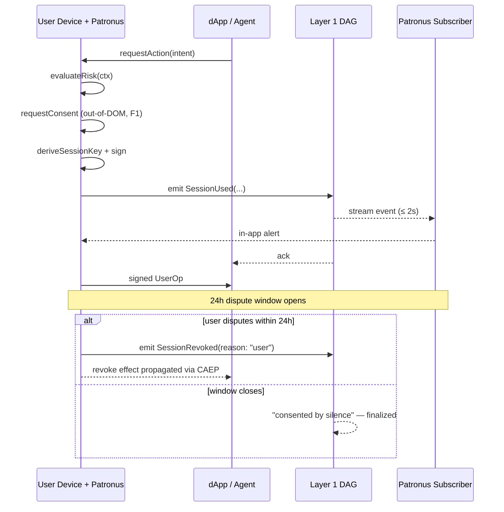

# Conspicuous Usage — The Defining Principle

> No identity action is silent.

## 1. The principle, stated formally

For every operation `op` performed against a user's identity:

```
emit_event(op)  →  alert_user(op)  →  serve(op)
```

The order matters. `emit_event` happens **before** `serve`. If the emission fails (network down, DAG node unreachable), the operation does not proceed. Liveness loss is acceptable; silent identity actions are not.

This applies uniformly to:
- Session issuance (`SessionIssued`)
- Session use (`SessionUsed`)
- Session revocation (`SessionRevoked`)
- Session replay attempts (`SessionReused`)
- Delegations (`DelegationGranted`)
- AI agent actions (`AgentAction`)
- Storage access (`StorageAccess`)
- Anomalies (`AnomalyDetected`)
- HumanKey tribunal attestations, mints, recovery state changes, inheritance ticks.

The canonical signatures live in [`interfaces/contracts/events/IConspicuousUsageEvents.sol`](../interfaces/contracts/events/IConspicuousUsageEvents.sol). The full taxonomy is reproduced in [`01-layer1-blockdag.md`](01-layer1-blockdag.md) §4.

## 2. Why this works against modern threats

| Threat | Why Conspicuous Usage defeats / mitigates it |
|---|---|
| **V1 — AiTM session theft** (Evilginx, Tycoon 2FA): attacker captures the user's cookie via reverse-proxy phishing. | The cookie alone authorizes nothing; the session-key signature is needed. Any signing attempt by the attacker emits `SessionUsed` to the DAG, which Patronus surfaces in seconds. The 24h dispute window invalidates the action. |
| **V11 — OAuth consent phishing** ("EvilTokens", CSA May 2026): user is tricked into granting a malicious OAuth app durable refresh tokens. | The grant emits `DelegationGranted`. Patronus surfaces it immediately. The user revokes in seconds. |
| **V10 — AI agent token theft** (Mitiga, `~/.claude.json`): attacker exfiltrates the agent's stored OAuth token. | Ephemeral session keys are HKDF-derived per session, never persisted, so there is nothing to exfiltrate. Any forged action would emit `AgentAction` from a session key the user doesn't recognize. |
| **V13 — Sub-agent authority inheritance** (OpenID Foundation Oct 2025): an AI agent silently spawns a sub-agent inheriting its scope. | The spawn emits `DelegationGranted` with the parent session ID. Patronus shows the user the spawn within the alert window. F3 consent transitivity (see [`09-consent-transitivity.md`](09-consent-transitivity.md)) bounds the sub-agent's scope. |
| **V9 — Post-auth session theft (general)**: stolen JWT replayed from attacker infra. | The replay emits `SessionUsed` from an unexpected source pattern → `AnomalyDetected` → auto-revoke per Patronus policy. |

## 3. The lifecycle of a conspicuous event



## 4. Alert transport

Alerts are abstract from the protocol's perspective: any channel that delivers within the dispute window is acceptable. The reference design supports:

- **In-app push** (Patronus mobile/desktop).
- **Hardware token blink/buzz** (FIDO2-style companion device).
- **Email/SMS** — explicitly **last-resort opt-in only**. Never the only channel. Designed to be additive, not load-bearing, because email/SMS are themselves attackable (V7 — passkey recovery via SMS is the new attack surface).

The user's policy chooses the channel set per pairwise DID. Patronus enforces the policy.

## 5. The 24-hour dispute window

After an event is emitted, the user has **24 hours by default** to dispute it. The window is:

- **User-configurable** — high-value users may shorten it (e.g., 1h for financial flows) or extend (e.g., 72h for low-value).
- **Hard floor of 1h** — even a user who wants "no friction" gets at least one hour to revoke.
- **Wall-clock, not session-time** — vacationing users do not lose the window by being offline; on reconnect Patronus replays missed events.
- **Per pairwise DID** — different dApps can have different windows; high-value DeFi might be 1h, social login might be 72h.

After the window closes, the action is "consented by silence" and propagates as final to relying parties via CAEP (see appendix A).

## 6. The dispute action

When the user disputes within the window:

1. Patronus emits `SessionRevoked(sessionId, reason: REASON_CODES.STOLEN)` or `SessionRevoked(reason: REASON_CODES.USER)` depending on user-stated reason.
2. The revocation is anchored at the next epoch.
3. Any in-flight UserOp signed by that session is rejected by the ERC-4337 validator (the validator checks the on-chain revocation bitmap).
4. The relying party receives a CAEP `session-revoked` event and is required to invalidate any derived state (per the CAEP receiver contract).

## 7. Privacy considerations

Conspicuous Usage emits events that *carry information* about the user's behavior. Two design choices mitigate the privacy cost:

- **Pairwise DIDs** (`ADR-0003`) mean the events for `userX@uniswap` and `userX@aave` are linked to two unlinkable pairwise commitments, not to a single root identity.
- **`payloadHash` not payload** — the on-chain event commits to a hash; the body lives in StorageNet, encrypted to the same pairwise DID's KEM key. Even a node operator who sees the event cannot read what the action was.

## 8. Failure modes

| Failure | Mitigation |
|---|---|
| User ignores every alert | Patronus auto-revokes at the end of the dispute window if anomaly signals are present; otherwise the user has chosen the risk. |
| Alert channel down | Patronus retries; on extended outage, downgrades all sessions to require fresh consent before next use. |
| Adversary races the dispute window with a high-value action | Patronus's anomaly heuristics escalate atypical actions to High tier *before* the action is signed, not just after. |
| Notification fatigue | Alerts are coalesced per pairwise DID; "Patronus saw 12 events for `userX@uniswap` in the last hour, summary view available." |

## Appendix A — CAEP / SSF wire format (P1)

See [ADR-0008](adr/ADR-0008-caep-ssf-wire-format.md).

Keychain conspicuous events are also emitted in OpenID Continuous Access Evaluation Profile 1.0 / Shared Signals Framework format so that any **standards-compliant receiver** (Okta, Microsoft Entra, Google Cloud Identity, every enterprise SSO) can consume Keychain telemetry without a custom integration.

Mapping (canonical → CAEP):

| Keychain event | CAEP event-type |
|---|---|
| `SessionIssued` | `https://schemas.openid.net/secevent/caep/event-type/session-established` |
| `SessionRevoked` | `https://schemas.openid.net/secevent/caep/event-type/session-revoked` |
| `AnomalyDetected` (severity ≥ threshold) | `https://schemas.openid.net/secevent/caep/event-type/assurance-level-change` (downgrade) |
| `DelegationGranted` | `https://schemas.openid.net/secevent/caep/event-type/token-claims-change` (scope changed) |
| `SessionUsed`, `AgentAction`, `StorageAccess` | `https://schemas.openid.net/secevent/caep/event-type/session-presented` (with custom subject metadata) |
| `Minted`, `RecoveryInitiated`, `LineageRebound`, `InheritanceTick` | Out-of-CAEP-scope; emitted only on the Keychain native format and HumanKey-specific webhooks. |

The transport is a Security Event Token (SET) — a signed JWT per the SSF spec. Implementation surface lives in [`interfaces/ts/caep-emitter.ts`](../interfaces/ts/caep-emitter.ts).

## 9. Acceptance criteria

1. The lifecycle in §3 matches [`diagrams/03-conspicuous-usage-sequence.mmd`](../diagrams/03-conspicuous-usage-sequence.mmd).
2. The event taxonomy in §1 is consistent with [`events/IConspicuousUsageEvents.sol`](../interfaces/contracts/events/IConspicuousUsageEvents.sol).
3. The CAEP mapping in Appendix A is consistent with [ADR-0008](adr/ADR-0008-caep-ssf-wire-format.md) and `caep-emitter.ts`.
