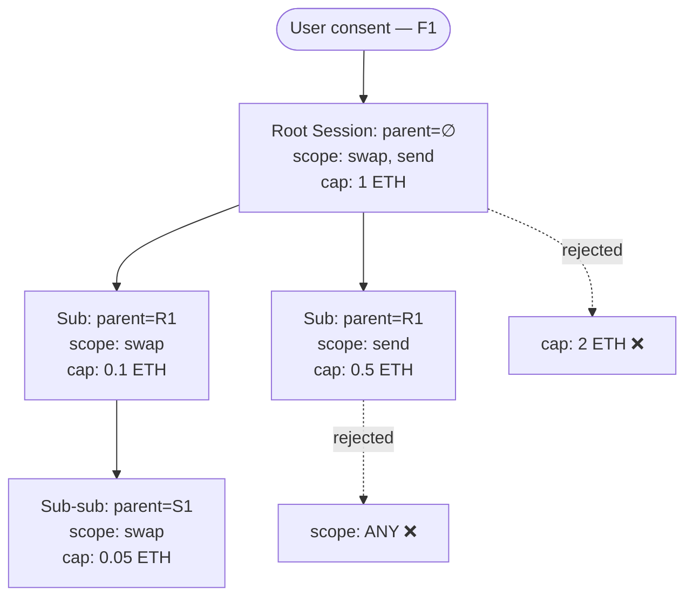

# Consent Transitivity (F3)

> Sub-agent inheritance, bounded by construction.

## 1. The problem

OAuth 2.0 was designed for bounded, human-initiated delegation: a user clicks "Allow" once, the app gets a token, the app uses the token. The 2025–2026 reality is different. AI agents now:

- Spawn sub-agents that inherit the parent's authority without a new consent event.
- Execute multi-step workflows with no human in the loop.
- Blend the user's delegated authority with their own machine identity.

The OpenID Foundation's October 2025 whitepaper on identity management for agentic AI named this gap explicitly. The CSA's May 2026 "OAuth Gap" research note documented its real-world impact: one compromised AI vendor's tokens granted attacker access across 800+ tenants because of unchecked sub-agent fan-out.

This is V13 in the threat model. Keychain's answer is **consent transitivity**.

## 2. The rule

**Any session derived from a parent session must have scope ⊆ parent scope.**

Concretely, for parent session `P` and derived session `D`:

| Property | Constraint |
|---|---|
| `D.allowedSelectors` | ⊆ `P.allowedSelectors` |
| `D.maxValueWei` | ≤ `P.maxValueWei` |
| `D.validUntil` | ≤ `P.validUntil` |
| `D.requiredAal` | ≥ `P.requiredAal` (cannot down-step assurance) |
| `D.geoFenceHash` | If `P.geoFenceHash != 0`, must equal it; otherwise free |
| `D.pairwiseCommitment` | Must equal `P.pairwiseCommitment` (sub-sessions inherit the parent's dApp binding) |

A sub-session that violates any of these is **rejected on installation** by `IEphemeralSessionKeyManager.installSessionKey`. There is no path to a more-permissive child.

## 3. On-chain encoding

The `SessionKeyParams` struct carries `parentSessionId: bytes32`:
- `bytes32(0)` → this is a root session (consent came directly from the user via F1 out-of-DOM).
- non-zero → this is a child session; the validator looks up the parent and enforces the constraints in §2.

The `SessionIssued` event in [`IConspicuousUsageEvents.sol`](../interfaces/contracts/events/IConspicuousUsageEvents.sol) includes `parentSessionId` so subscribers can build the delegation tree off-chain.

## 4. The delegation tree

Each pairwise DID can have many root sessions, each rooted at user consent. From each root, the agent may derive sub-sessions for sub-agents, tools, or downstream services. The result is a **delegation tree**.



## 5. Attribution

When `D` performs an action and emits `AgentAction`, the event chain is queryable:

```
AgentAction(D) → SessionIssued(D) carries parentSessionId=S
                                                      ↓
                                               SessionIssued(S) carries parentSessionId=R
                                                                                      ↓
                                                                       SessionIssued(R) carries parentSessionId=0
                                                                                      ↓
                                                                   ← root consent event traceable to user
```

Patronus surfaces the **full chain** in the alert UI, so the user never has to wonder "which agent of mine did this?"

## 6. Revocation cascades

Revoking a parent session revokes the entire subtree. The on-chain implementation:

1. `revokeSessionKey(R)` sets the bitmap bit for R.
2. `validateUserOp` for any descendant walks up the chain; if any ancestor is revoked, validation fails.
3. The corresponding `SessionRevoked` events are emitted for the entire subtree at next epoch.

Cost: one bitmap write to revoke an arbitrarily large subtree. The walk-up is O(depth), bounded in practice by Patronus policy (default max depth 4).

## 7. Anti-escalation invariant

The rule in §2 is **monotonic**: descending the tree, scopes can only narrow. There is no way to "redeem" a broader scope further down. Combined with the always-emitted `DelegationGranted` event, this makes sub-agent escalation:

1. Either rejected on-chain at install time, or
2. Observable in the alert stream within seconds.

There is no third option.

## 8. Interaction with HumanKey adaptive escalation

The `requiredAal` constraint (children ≥ parent) means a Low-tier root session cannot derive a High-tier child by design. To use High-tier authority, the user must consent at the High tier — which routes through HumanKey's Cognitive MFA + TEE liveness flow. Sub-agents cannot escalate themselves.

## 9. Edge cases

| Case | Behavior |
|---|---|
| Parent session expires before child does | Child's `validateUserOp` checks ancestors; the child becomes unusable when the parent expires. This is by design. |
| Parent revoked, child has active funds in-flight | The in-flight UserOp fails validation; the user is alerted; funds remain with the user. |
| Agent forgets to set `parentSessionId` | Validator rejects with `MissingParent`. Patronus's SDK enforces this client-side too. |
| User wants two sibling sub-sessions with disjoint scopes | Allowed; each sibling is a separate child with `parentSessionId = R`. |
| Multi-rooted derivation (one child of two parents) | Disallowed. `parentSessionId` is a single field. Use sibling sub-sessions instead. |

## 10. Acceptance criteria

1. The constraints in §2 are mechanically enforced in `IEphemeralSessionKeyManager.validateUserOp` (per NatSpec).
2. `parentSessionId` is present in `SessionKeyParams`, `SessionPolicy` (shared struct), and the `SessionIssued` / `DelegationGranted` events.
3. Patronus surfaces the full chain in the alert UI (per `04-patronus-guardian.md` §6).
4. The diagram in §4 matches the actual on-chain enforcement.
